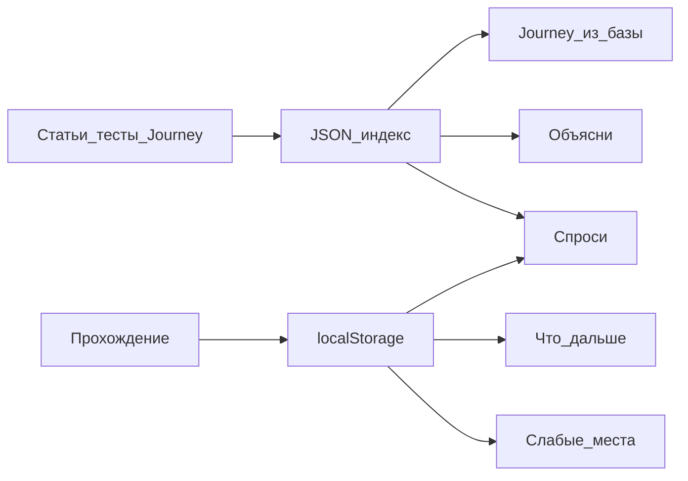

# Lab Keeper — справка и план действий

Статус шагов 1–10: выполнены (см. [DEV_NOTES.md](./DEV_NOTES.md)).

## Название

Продукт: **Lab Keeper**. Репозиторий: `lab-keeper`. В шапке: Lab Keeper. Слоган: «библиотекарь Prompt Lab». Визуал и контент остаются от Prompt Lab (`#161616` / `#84CC16`).

## Что это

**Lab Keeper** — умная оболочка над образовательной платформой. Prompt Lab была «полкой с книгами» (готовые статьи, Journey с нуля, без памяти). Lab Keeper — **библиотекарь**: ищет по материалам лаборатории, помнит прогресс, ведёт дальше.

База: [prompt-lab](https://github.com/NadyaLenkovets/prompt-lab) (статьи, 9 типов упражнений, тесты) + [knowledge-journey](https://github.com/NadyaLenkovets/knowledge-journey) (Hono, OpenRouter, Journey). Не копируем соседний `Prompt-Engineering-Academy`.

## Зачем

- Ученик не теряется: что пройдено, где дыры, что открыть дальше.
- Один корпус контента отвечает на вопросы, объясняет и собирает новый Journey.
- Ответ с источниками, а не «модель вспомнила». AI-контент помечен отдельно от человеческого.

## Стек

React 19, TypeScript, Vite, React Router 7, Chakra v3, Hono, Zod, OpenRouter (chat + embeddings), JSON-индекс + cosine, Vitest, Playwright, Vercel.

Ключ только в `.env`. Без аккаунтов, Postgres и векторной БД.

## Что умеет пользователь

| Где | Что происходит |
|---|---|
| `/main` | Статьи, вход в тесты / Journey / «Спросить» |
| `/article/:slug` | Статья + упражнения + кнопка «Объясни проще» |
| `/tests/:slug` | Тест 10 шагов; после — слабые места и «что дальше» |
| `/create` → `/journey/:id` | Journey; live — сборка **из индекса**, не с нуля |
| `/ask` | Вопрос → ответ + карточки источников; пресеты действий |
| `/profile` | Прогресс, слабые темы, экспорт JSON / удалить данные |

Без ключа: статьи, тесты, demo-journey, профиль. С ключом: RAG и все AI-действия.

## Как устроено внутри

- **Чанки:** статья по блокам; тест/упражнение = вопрос+ответ+пояснение; Journey по блокам. Мета: тип, slug, url, `origin: human | ai`.
- **Поиск:** embedding → top-k → LLM с цитатами. Нет чанков — «в корпусе этого нет».
- **Профиль:** темы, баллы, ошибки, время. В промпт — сжатые 15–20 строк, не сырой лог.
- **4 действия:** спроси платформу; объясни проще; слабые места; что дальше. Сверх: grounded Journey + пресет «как X связан с Y».

---

## Пошаговый план

Каждый шаг — до рабочего состояния, потом следующий. В конце шага — запись в `DEV_NOTES.md`. Промпты — в `PROMPTS.md`.

### Шаг 1 — Каркас и документация процесса

- Создать `DEV_NOTES.md` (цель, решения, итерации) и заготовку `PROMPTS.md`.
- Скопировать **Knowledge Journey** в этот workspace как основу (сервер, OpenRouter, `dev:all`).
- Перенести из Prompt Lab: `src/content`, `src/components/exercises`, страницы статей/тестов, theme при необходимости.
- Итог: `npm run dev:all` поднимает объединённый проект.

### Шаг 2 — Единый UI

- Одна шапка: **Lab Keeper**, Статьи, Тесты, Journey, Спросить, Профиль.
- Склеить роутер (маршруты из таблицы выше). Главная `/main` показывает оба мира.
- Итог: руками пройти статья → тест → demo-journey без регрессий.

### Шаг 3 — Чанкинг

- Функции: статья → чанки по блокам; упражнение/тест → чанк Q&A; journey-блок → чанк.
- Unit-тесты на нарезку.
- Итог: скрипт печатает число чанков по типам, без эмбеддингов.

### Шаг 4 — Индекс и поиск

- `npm run rag:index`: OpenRouter embeddings → `data/rag-index.json` (файл в git, чтобы не жечь лимиты каждый раз).
- `POST /api/rag/search`: cosine, top-k, порог релевантности.
- Итог: curl/запрос «галлюцинации» возвращает чанки из статьи/теста.

### Шаг 5 — «Спроси платформу»

- `POST /api/ask`: retrieve + LLM, ответ только по чанкам, источники обязательны.
- Страница `/ask` + пункт в шапке. Карточка источника со ссылкой.
- Итог: вопрос «что я знаю о галлюцинациях?» → текст + источники, клик открывает статью.

### Шаг 6 — Персональный контекст

- Писать в `localStorage` (`lab-keeper-learner`) прогресс статей, тестов, journey (баллы, ошибки, время, агрегаты тем).
- `/profile`: прогресс, слабые темы, **Экспорт**, **Удалить всё**.
- В API ask/действий передавать сжатый профиль.
- Итог: прошёл тест → профиль обновился; очистка стирает данные.

### Шаг 7 — «Объясни проще»

- Кнопка на блоке статьи (и пресет на `/ask`).
- Тот же RAG, другой промпт; если тема в профиле слабая — ещё проще.
- Итог: в статье нажимаешь кнопку → упрощённый абзац, не общий чат.

### Шаг 8 — «Слабые места» и «Что дальше»

- После теста и на отчёте Journey: две кнопки.
- Анализ — из профиля; рекомендации — профиль + RAG (конкретная статья/тест/journey).
- Итог: после слабого теста видишь дыры и 2–3 следующих шага со ссылками.

### Шаг 9 — Journey из базы

- `/create`: retrieve по теме → генерация маршрута с опорой на чанки, ссылки на статьи.
- Сохранение с `origin: ai`; дозапись в индекс.
- Итог: тема «структура промпта» даёт Journey, который опирается на существующую статью, в UI метка «сгенерировано AI».

### Шаг 10 — Сдача

- README: стек, RAG, AI-действия, персонализация, запуск, сценарий «как попробовать».
- E2E: статья → ask + источники; тест → профиль; demo-journey.
- Деплой Vercel (ключ в env, индекс в репо).
- Итог: репозиторий + README + DEV_NOTES с историей шагов 1–10.

## Не делаем

Аккаунты, Postgres/pgvector, мобильная вёрстка, CMS, чат без источников как отдельный продукт.

## Риски

- Склейка двух SPA: не дублировать theme и layout.
- Лимиты OpenRouter: индекс собирать один раз, не эмбеддить на каждый вопрос.
- Профиль не класть в индекс (корпус ≠ персональные данные).
